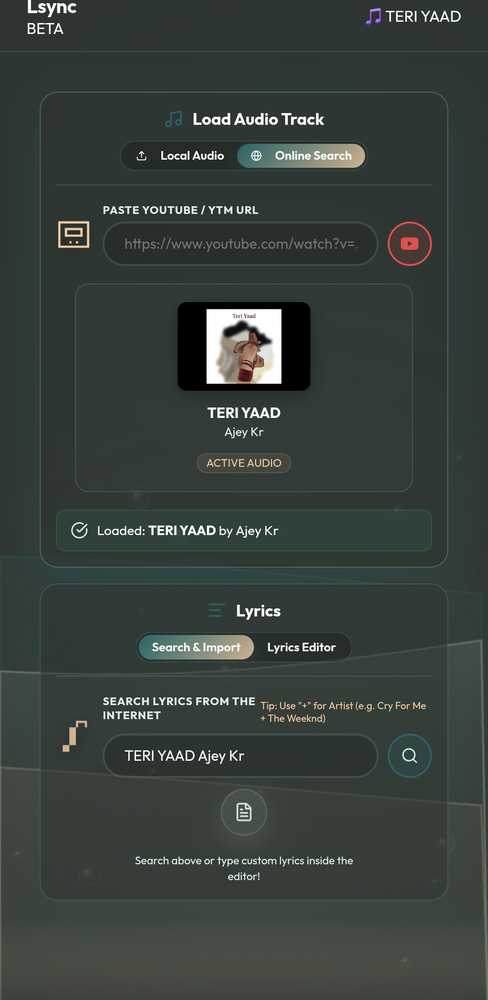
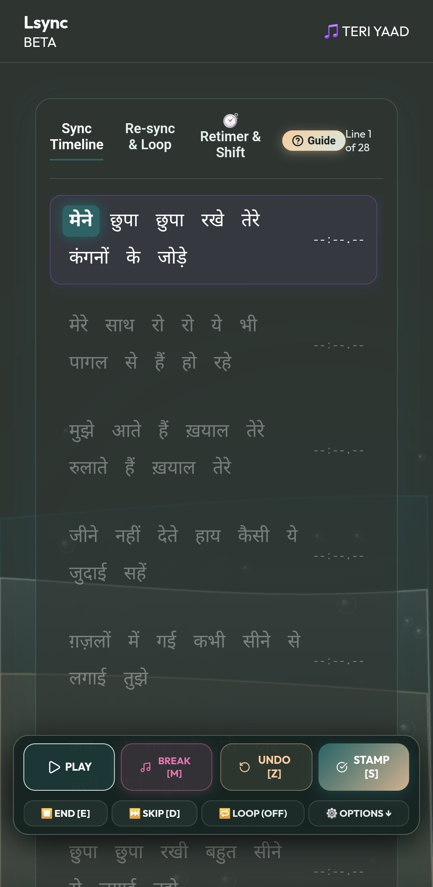
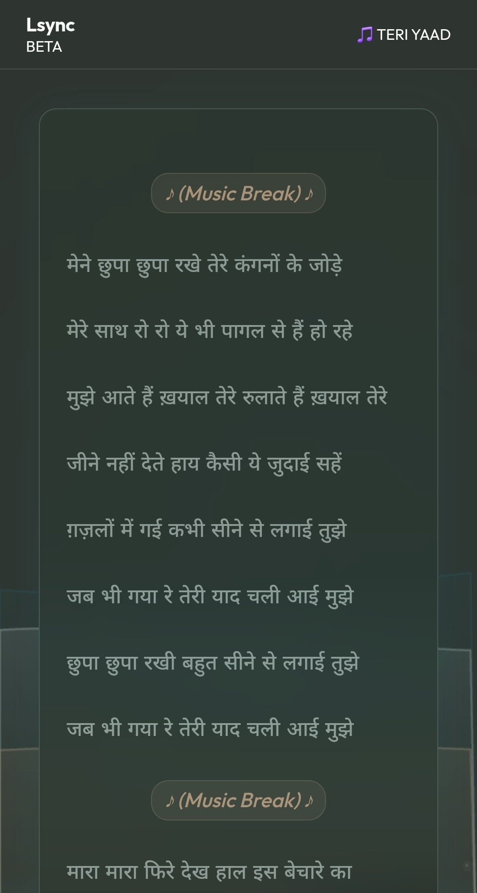
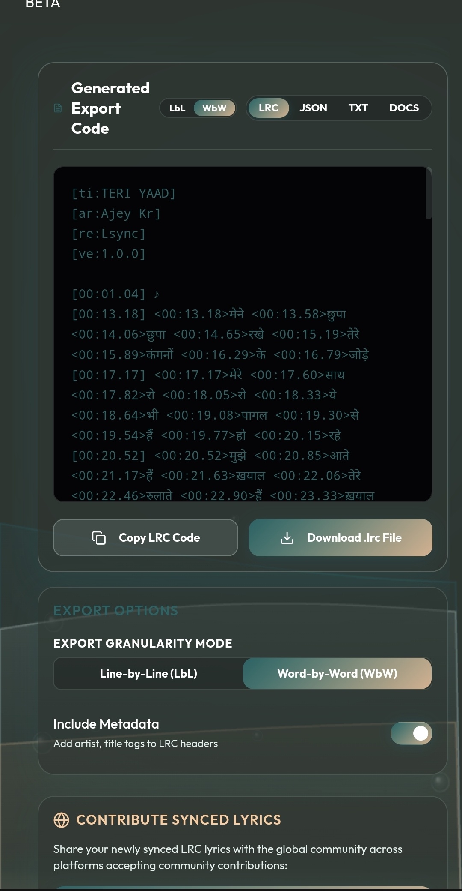
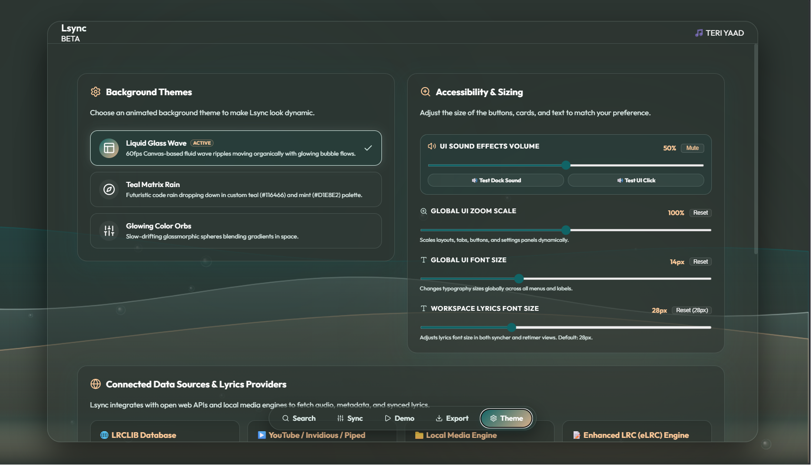
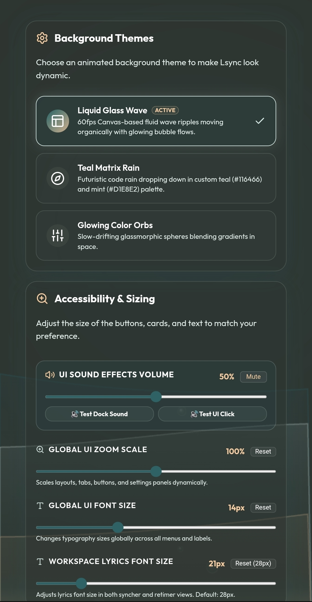

# 🎵 Lsync — Modern Synchronized Lyrics Editor & Builder

> **Lsync** is a state-of-the-art, ultra-fast web application designed for music lovers, lyricists, karaoke creators, and audio editors to build, edit, retime, and export line-by-line (`.lrc`), word-by-word (`eLRC`), text (`.txt`), and Word document (`.doc`) synchronized lyrics.

---

### 🌐 Live Web Access

Anyone on the web can access and use Lsync directly from their browser:  
👉 **[https://code4nigel.github.io/Lsync/](https://code4nigel.github.io/Lsync/)**

---

### 🖥️ 📱 Visual Tour & Interfaces (Desktop & Mobile)

Lsync features custom-crafted user interfaces designed for both **Desktop 💻** and **Mobile 📱** viewports, complete with a PUBG/BGMI-style ergonomic floating mobile controller dock.

#### 1. 🔍 Search & Import Lyrics Tab
Search lyrics online via open databases (LRCLIB), import YouTube / YouTube Music links with automatic title/artist parsing and `⇄ Swap` tool, or clean existing LRC tags with `🧹 Clean Timestamps & Tags`.

| Desktop View 💻 | Mobile View 📱 |
| :---: | :---: |
|  |  |

---

#### 2. ⚡ Real-Time Word & Line Synchronization Tab
Sync lyrics at 60 FPS with live audio playback, liquid glass visualizer, latency offset compensation, playback speed controls, and 1-tap thumb controls.

| Desktop View 💻 | Mobile View 📱 |
| :---: | :---: |
|  |  |

---

#### 3. ⏱️ Retimer & Precision Time Shift Tool
Shift entire song timings forward or backward by custom milliseconds or seconds with live side-by-side demo testing.

| Retimer & Time Shift Tool ⏱️ |
| :---: |
|  |

---

#### 4. 🎤 Live Demo Karaoke Player Tab
Preview synced lyrics in real-time with smooth karaoke highlight animations and video/audio background sync.

| Desktop View 💻 | Mobile View 📱 |
| :---: | :---: |
|  |  |

---

#### 5. 📄 Export & Format Generator Tab
Export and download synchronized lyrics in standard **Line-by-Line (LbL)** `[mm:ss.xx]`, enhanced **Word-by-Word (WbW)** `<mm:ss.xx>`, plain text `.txt`, and Word `.doc` formats.

| Desktop View 💻 | Mobile View 📱 |
| :---: | :---: |
|  |  |

---

#### 6. 🎨 Personalization & Themes Tab
Customize UI scale, workspace font size, audio volume, and liquid glass background visualizers (Waves, Stars, Nebula, Grid).

| Desktop View 💻 | Mobile View 📱 |
| :---: | :---: |
|  |  |

---

### ✨ Key Features & Enhancements

- **⚡ 60 FPS Audio Visualizer:** Liquid glass canvas rendering reacting to live audio playback.
- **📱 Ergonomic Floating Mobile Controller Dock:** PUBG/BGMI-style bottom floating HUD for 2-thumb mobile syncing (`PLAY`, `BREAK [M]`, `UNDO [Z]`, `STAMP [S]`, `END [E]`, `SKIP [D]`, `🔁 LOOP`, `⚙️ OPTIONS`).
- **🎵 YouTube Title Auto-Fill & `⇄ Swap` Button:** Automatically extracts song title & artist name from YouTube / YTM URLs with quick swap capability.
- **🧹 Clean Timestamps & Tags:** Converts raw synced LRC files into clean plain text lines with 1 click.
- **⏱️ Retimer & Time Shift Mode:** Precision millisecond & second time-shifting across entire tracks or selected line sections.
- **🎛️ Latency & Speed Controls with Reset Buttons:** Adjust latency offset (default -100ms) and playback speed (0.4x to 1.0x) with instant reset buttons.
- **📏 Lyrics Font Size Slider:** Change lyrics workspace font size (default 22px on mobile, 28px on desktop) directly inside Sync Options or Theme tab.
- **📄 Multi-Format Exporter:**
  - **LRC (`.lrc`)** — Standard Line-by-Line & Enhanced Word-by-Word.
  - **JSON (`.json`)** — Structured word & line timing metadata.
  - **Text (`.txt`)** — Plain text, LbL timed text, and WbW tagged text.
  - **Word Document (`.doc`)** — Formatted Microsoft Word & Google Docs exports.
- **⌨️ 1-Key Hotkey Workflow:**
  - `SPACE` — Play / Pause audio
  - `S` or `ENTER` — Stamp line / word timestamp
  - `Z` or `BACKSPACE` — Undo last timestamp
  - `M` — Insert instrumental music break `[mm:ss.xx] ♪`
  - `E` — Mark end of line timestamp
  - `D` — Skip current line
  - `A` / `B` — Set loop range markers

---

### 🌐 Connected Data Sources & References

| Provider / Engine | Description | Reference Link |
| :--- | :--- | :--- |
| **LRCLIB Database** | Open-source global database for plain and synced LRC lyrics | [lrclib.net](https://lrclib.net) |
| **YouTube / Invidious / Piped** | Decentralized video streaming nodes & audio playback | [invidious.io](https://invidious.io) |
| **Web Audio API Engine** | High-fidelity local browser audio engine (`.mp3`, `.flac`, `.wav`, `.m4a`) | Web Audio API |
| **eLRC Engine** | Native parser & builder for line and word timestamps | Enhanced LRC Spec |

---

### 👤 Author & Credits

Crafted with ❤️ by **NigelWeb** ([github.com/code4nigel](https://github.com/code4nigel)), Lead Architect of **Lsync** & **Scrobby**.

---

### 📜 License

This project is licensed under the **GNU General Public License v3.0 (GPL-3.0)** — see the [LICENSE](LICENSE) file for full details.
