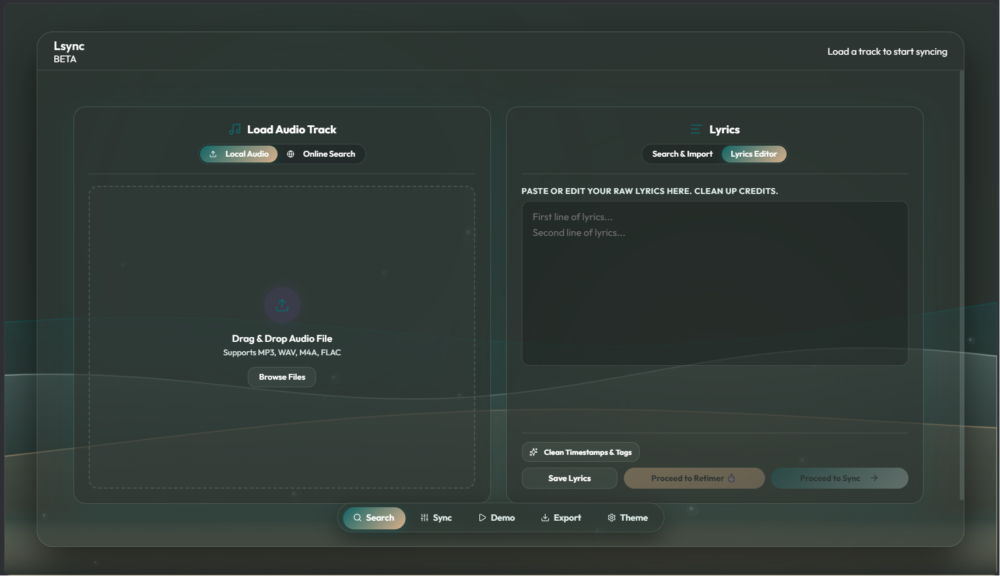
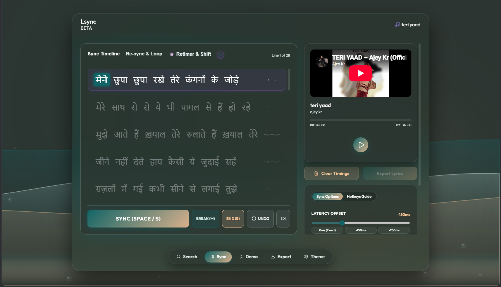
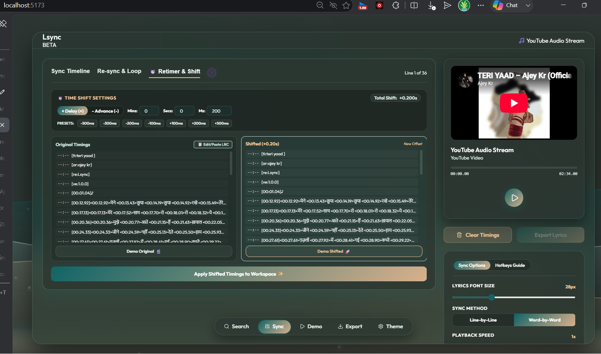
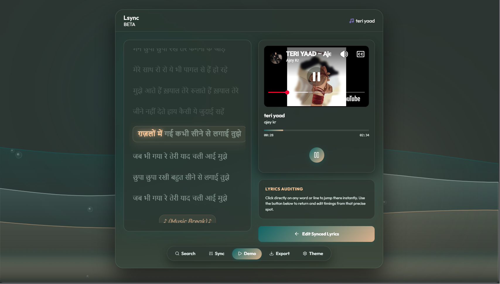
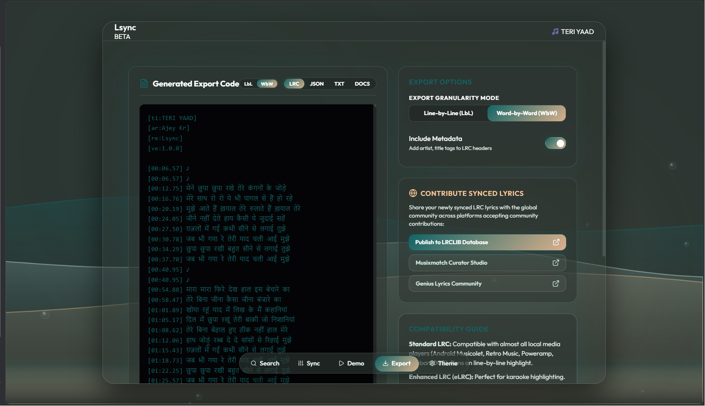

# Lsync — Modern Synchronized Lyrics Editor & Builder

> **Lsync** is a state-of-the-art, ultra-fast web application designed for music lovers, lyricists, and karaoke creators to build, edit, retime, and export line-by-line (`.lrc`) and word-by-word (`eLRC`) synchronized lyrics.

---

### 🌐 Live Web Access

Anyone on the web can access and use Lsync directly from their browser at:  
**👉 [https://code4nigel.github.io/Lsync/](https://code4nigel.github.io/Lsync/)**

---

### 🖼️ Visual Tour & Screenshots

#### 1. 🔍 Search & Import Lyrics
Search lyrics directly from open internet databases or paste plain text into the editor.

#### 2. ⚡ Real-Time Word & Line Synchronization
Synchronize lyrics at 60 FPS with liquid wave visualizers, live audio controls, latency offset compensation, and 1-key hotkeys (`SPACE`, `S`, `M`, `E`, `Z`, `A`, `B`).

#### 3. ⏱️ Retimer & Precision Time Shift Tool
Shift entire song timing forward or backward by custom minutes, seconds, and milliseconds with side-by-side comparison.

#### 4. 🎤 Live Demo Lyrics Player
Preview synced lyrics in real-time with smooth karaoke highlight animations and video/audio background sync.

#### 5. 📄 Dual LbL & WbW Export Engine
Export and copy synchronized lyrics in standard **Line-by-Line (LbL)** `[mm:ss.xx]` or enhanced **Word-by-Word (WbW)** `<mm:ss.xx>` formats.

---

### ✨ Key Features

- **⚡ 60 FPS Audio Visualizer:** Liquid wave canvas rendering reacting to live audio playback.
- **🎤 Word-by-Word & Line-by-Line Syncing:** Supports standard line timestamps `[mm:ss.xx]` and inline word tags `<mm:ss.xx>`.
- **⏱️ Retimer Mode:** Precision latency shifting across entire tracks with live side-by-side demo testing.
- **⌨️ 1-Key Hotkey Workflow:**
  - `SPACE` — Play / Pause audio
  - `S` or `ENTER` — Stamp line / word timestamp
  - `Z` or `BACKSPACE` — Undo last timestamp
  - `M` — Insert instrumental break `[mm:ss.xx] ♪`
  - `E` — Mark end of line timestamp
  - `D` — Skip current line
  - `A` / `B` — Set loop range markers
- **📄 Dual Granularity Exporter:** 1-click `Copy LbL`, `Copy WbW`, `Download LbL (.lrc)`, and `Download WbW (.lrc)`.
- **🌐 Open Data & Community Contribution:** Direct integration and submission links to LRCLIB, Musixmatch Curator Studio, and Genius.
- **✨ NigelWeb Developer Profile:** Interactive Nigel Facts bubble cycling developer stories.

---

### 🌐 Connected Data Sources & References

Lsync integrates with open web APIs and local media engines:

| Provider / Engine | Description | Reference Link |
| :--- | :--- | :--- |
| **LRCLIB Database** | Open-source global database for plain and synced LRC lyrics | [lrclib.net](https://lrclib.net) |
| **YouTube / Invidious / Piped** | Decentralized video streaming nodes & audio playback | [invidious.io](https://invidious.io) |
| **Local Media Engine** | High-fidelity local browser audio engine (`.mp3`, `.flac`, `.wav`, `.m4a`) | Web Audio API |
| **eLRC Engine** | Native parser & builder for line and word timestamps | Enhanced LRC Spec |

---

### ⚠️ Device Compatibility Note

> [!IMPORTANT]
> **PC & Desktop:** Fully tested, optimized, and recommended for the best workflow experience.  
> **Mobile Devices:** Touch layout is responsive and usable, but full mobile optimization is currently undergoing refinement.

---

### 👤 Author & Credits

Crafted with ❤️ by **NigelWeb** ([github.com/code4nigel](https://github.com/code4nigel)), Lead Architect of **Lsync** & **Scrobby**.

---

### 📜 License

This project is licensed under the **GNU General Public License v3.0 (GPL-3.0)** — see the [LICENSE](LICENSE) file for full details.
